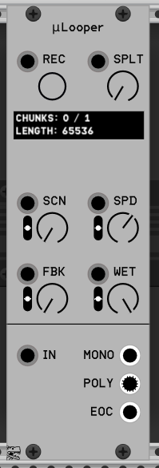
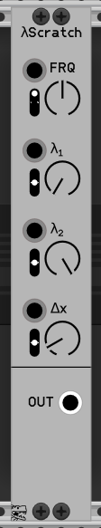
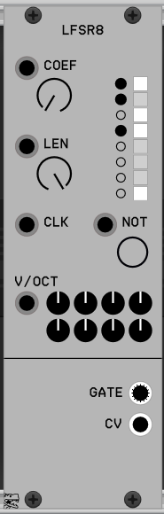
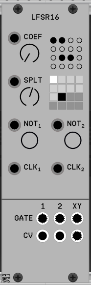
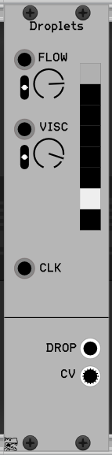
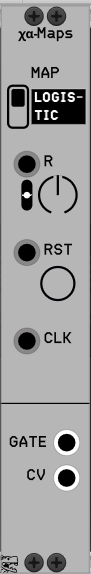
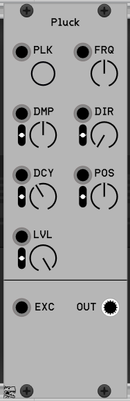
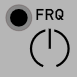
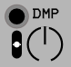

# Modules for VCV Rack 2

## muLooper

Recording looper for very short (4096 ~ 65536 samples length) recordings.

### Controls

- **REC**: Record. Push button to fill the buffer.
- **SPLT**: Split. Split the whole buffer (65536 samples for number of chunks).
- **SCN**: Scan. Lineary interpolates between chunks.
- **SPD**: Speed. playback speed. Use negative values to play backwards.
- **FBK**: Feedback. Overdub previous buffer.
- **WET**: Dry/Wet. Mix input and recorded signals.

### Inputs

- **IN**: Recording signal input.

### Outputs

- **MONO**: Play current chunk (with interpolation between it and the next one).
- **POLY**: Up to 16 chunks distributed across channels.
- **EOC**: Trigger in the end of the record.

---

## LogisticScratch

Glitchy and scratchy oscillator. Based on https://www.mathematica-journal.com/2013/05/27/using-the-logistic-map-to-generate-scratching-sounds/ algorithm.

### Controls

- **FRQ**: Playback frequency with CV input below.
- **λ1**: Coefficient for the logistic equation `x = λx(1-x)`
- **λ2**: Second coefficient for the logistic equation. Oscillator oscillates between **λ1** and **λ2** with playback frequency.
- **Δx**: See article above for explanation.

NB! Due to chaotic nature of this oscillator it's nearly impossible to keep the steady pitch. Use lower **λ1**, **λ2** values and higher **Δx** values for more mellow results or use it as exciter for physical modelling resonators (see the Pluck module below).

---

## LFSR8 (polyphonic)

8-bit Linear Feedback Shift Register (LFSR) sequencer. Consider it like fully deterministic Turing Machine sequencer*

* Random values in Turing Machine are generated using LFSR under the hood, so Turing Machine sequencer is fully deterministic as well.

### Controls

- **COEF**: Decimal representation of LFSR coefficients.
- Small buttons to the right are LFSR coefficients.
- Small square lights are shift register bits.
- **LEN**: Sequence length.
- **NOT**: Use `XNOR` instead of `XOR` for LFSR.
- **V/OCT**: Black knobs are used to generate pitch information from the shift register bits. The result is scaled with the corresponding input.

### Inputs

- **CLK**: Input trigger.

### Outputs

- **GATE**: Polyphonic gate output from the shift register bits.
- **CV**: CV output from the shift register bits.

NB! Register may be emptied and sequence will be stuck. You can use **NOT** button to feed 1-bit to the sequence.

---

## LFSR16 (polyphonic)

16-bit Linear Feedback Shift Register (LFSR) sequencer which can be splitted for two independent sequences.

### Controls

- Small buttons are LFSR coefficients.
- Small square white and black lights are shift registers' bits.
- **COEF**: Decimal representation of LFSR coefficients (for both sequences combined).
- **SPLT**: Split one register for two with the total length of 16 bits.
- **NOT1**, **NOT2**: Use `XNOR` instead of `XOR`.

### Inputs

- **CLK1**, **CLK2**: Triggers to run corresponding sequence.

### Outputs

- **GATE**
  - **1**: Polyphonic gate output from the 1st shift register bits.
  - **2**: Polyphonic gate output from the 2nd shift register bits.
  - **XY**: XOR the bit sequence in the row (channels 1-4) or the column (channels 5-8) to open the gate.
- **CV**
  - **1**: Output from the 1st shift register bits (using bits as binary representation of the float number).
  - **2**: Output from the 2nd shift register bits (using bits as binary representation of the float number).
  - **XY**: Use the bit sequence in the row (channels 1-4) or the column (channels 5-8) as binary representation of the float CV value.

---

## Droplets

Experiment in hydrodynamics. Model of the liquid flow in the leaky faucet.

### Controls

- **FLOW**: The pressure of the incoming liquid.
- **VISC**: The liquid viscosity.
- Square lights are represents the pipe. The brightness in the cell corresponds to the amount of liquid in the cell.

### Inputs

- **CLK**: Trigger to process one liquid flow cycle.

### Outputs

- **DROP**: Each time the amount of liquid in the cell is large enough to overcome viscosity the drop occurs and the gate is open.
- **CV**: Polyphonic output. 8 channels, each for one cell.

---

## Chaos Maps

Sequencer based on chaotic maps (logistic and tent).

### Controls

- **MAP**: Switch between *Logistic* and *Tent* map.
- **R**: Map coefficient.
- **RST**: Reset button.

### Inputs

- **CLK**: Sequencer clock.

### Outputs

- **GATE**: Open the gate if the previous iteration value is bigger than the current one. Not very useful but whatever.
- **CV**: Current iteration value mapped to CV.

---

### Pluck

Venerable Karplus-Strong algorithm with the extensions. See https://ccrma.stanford.edu/realsimple/faust_strings/faust_strings.pdf

### Controls

- **PLK**: Pluck the string.
- **FRQ**: Base oscillator frequency.
- **DMP**: Damping coefficient. More is duller, less is brighter.
- **DCY**: Audio decay time in seconds (t60).
- **DIR**: Pluck direction. Up or down or some angle inbetween.
- **POS**: Pluck position. Closer to the bridge or to the string middle.
- **LVL**: Pluck velocity.

### Inputs

- **EXC**: Exciter input. You can use any sound to excite the pluck, white noise is used by default.

### Outputs
- **OUT**: Polyphonic output. You can play chords, yay!

## Generic info
There are some main building blocks for the modules, e.g.
### Mono output

### Poly output

### Input

### Knob without the modulation slider

The input above the knobs sets the value without the attenuation.

### Knob with the modulation slider

The input above the knobs sets the value with the attenuation given by slider. So the middle slider position (0) does nothing.