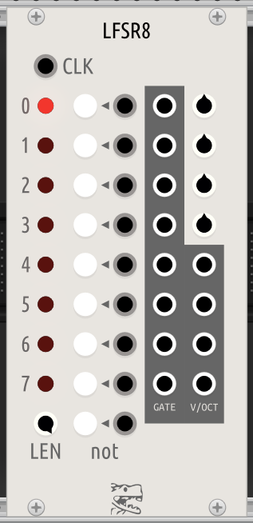
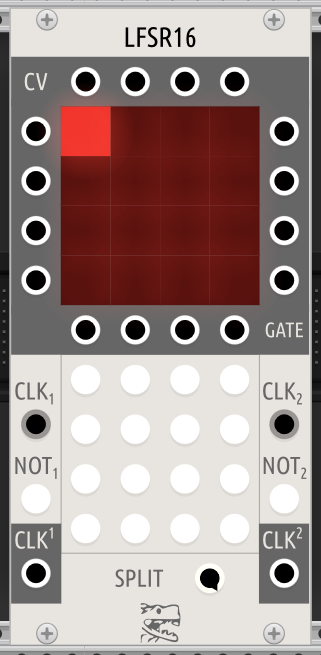

# Modules for VCV Rack 2

## MicroLooper


Recording looper for very short (256 ~ 32768 samples length) recordings.

### Controls

- RECORD: Push button to fill the buffer.
- LENGTH: Playback buffer length.
- SCAN: The whole recorded buffer is splitted into chunks with the length from control above. SCAN lineary interpolates between them.
- SPEED: playback speed. Use negative values to play backwards.

NB! Crackles and DC artifacts will occur.

## LogisticScratch


Glitchy and scratchy oscillator. Based on https://www.mathematica-journal.com/2013/05/27/using-the-logistic-map-to-generate-scratching-sounds/ algorithm.

### Controls

- FREQ: Playback frequency with CV input below.
- `λ1`: Coefficient for the logistic equation `x = λx(1-x)`
- `λ2`: Second coefficient for the logistic equation. Oscillator oscillates between `λ1` and `λ2` with playback frequency.
- `Δx`: See article above for explanation.

NB! Due to chaotic nature of this oscillator it's nearly impossible to keep steady pitch. Use lower `λ1`, `λ2` values and higher `Δx` values for more mellow results or use it as exciter for physical modelling resonators.

## LFSR8



8-bit Linear Feedback Shift Register (LFSR) sequencer. Consider it like fully deterministic Turing Machine sequencer<sup>*</sup>

### Controls

- CLK: Input trigger.
- LEN: Sequence length.
- White buttons (except `not`) are LFSR coefficients. Any coefficient can be set using the corresponding input.
- `not`: Use `XNOR` instead of `XOR` for LFSR.
- GATE: Any bit in shift register can be used as a GATE output. Gate is open when the corresponding led is lit.
- V/OCT: Uses four unnamed knobs above to generate CV which can be used for pitch information.
```
# p0 ... p3 are knob values
# x0 ... x8 are shift register bits
# v0 ... v3 are output voltages

v0 = p0(x0+x4)+p1(x1+x5)+p2(x2+x6)+p3(x3+x7)
v1 = p1(x0+x4)+p2(x1+x5)+p3(x2+x6)+p0(x3+x7)
v2 = p2(x0+x4)+p3(x1+x5)+p0(x2+x6)+p1(x3+x7)
v3 = p3(x0+x4)+p0(x1+x5)+p1(x2+x6)+p2(x3+x7)
```

NB! Register may be emptied and sequence will be stuck. You can use `not` button to reinitialize sequence.

----
<sup>*</sup> Random values in Turing Machine are generated using LFSR under the hood, so Turing Machine sequencer is fully deterministic as well.

## LFSR16



16-bit Linear Feedback Shift Register (LFSR) sequencer which can be splitted for two independent sequences.

### Controls

- White buttons are LFSR coefficients.
- SPLIT: Split one register for two with the total length of 16 bits.
- CLK<sup>1</sup>, CLK<sup>2</sup>: Triggers to run corresponding sequence.
- NOT<sup>1</sup>, NOT<sup>2</sup>: Use `XNOR` instead of `XOR`.
- CLK<sub>1</sub>, CLK<sub>2</sub>: Corresponding gate is opened when the first bit of the corresponding register is `1`.
- CV outputs: convert the bit sequence in the row or the column to CV (to use as a pitch)
- GATE outputs: XOR the bit sequence in the row or the column to open the gate.
